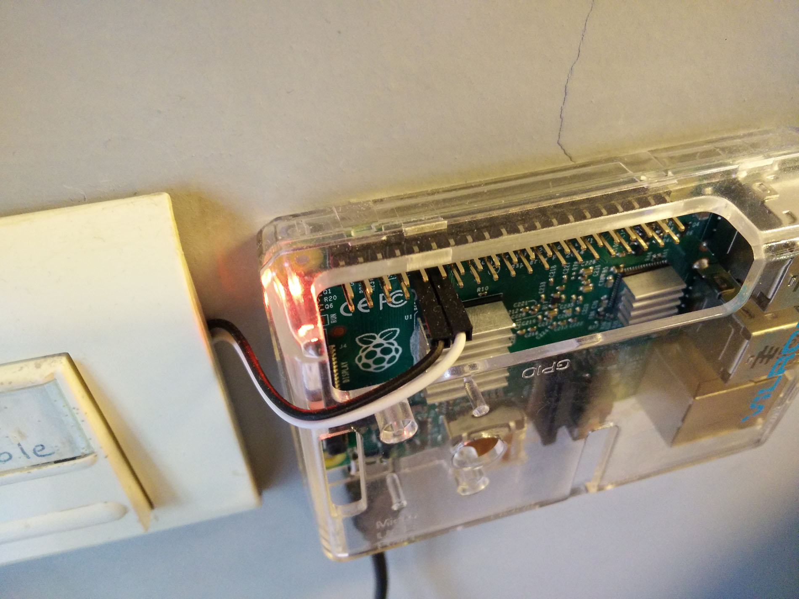
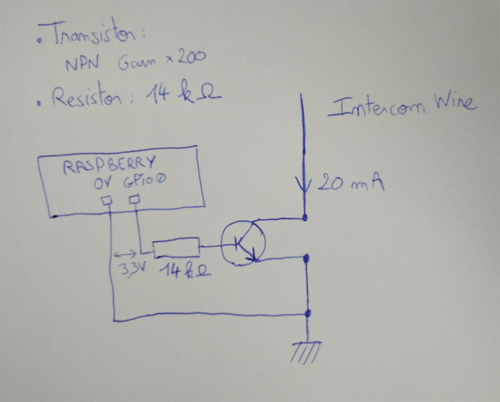

## Installation

Just run:
```
apt-get update
apt-get install -y make git sudo python g++
make
make install
```

This will start a django server that will expose the following URL: [http://localhost/door/open]. To open the door, just visit this URL. Don't forget to password-protect it ! ;-)

## Raspberry Pi

We use [WiringPi](http://wiringpi.com/) to control the pins of the Raspberry. The mapping between physical pins and WiringPi pin IDs is as follows:


We will use **GPIO0** to send the door opening signal and the **GND** (**0v**) next to it, aka the pins with headers 11 and 9, respectively.

The wiring will thus look like this:



## Circuit

You need:
- 1 NPN Transitor with 200 gain
- 1 Resistor of 14 kohms

The circuit is the following:


